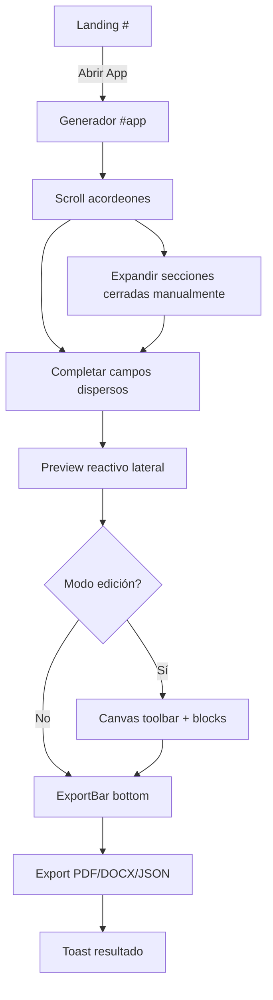
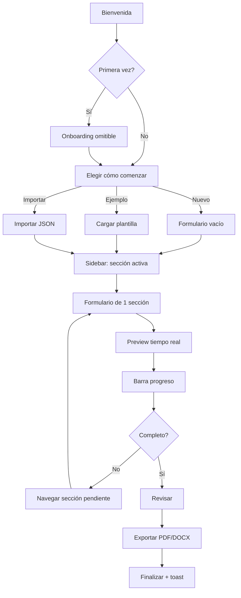

## Context

CertiPrácticas genera certificaciones de etapa productiva SENA mediante formulario + preview en tiempo real. Stack: React 19, TypeScript, Vite, Tailwind v4, Zustand, Motion.

**Estado actual:**
- Routing hash (`#` landing, `#app` generador)
- Layout split: formulario acordeón (40%) | preview (60%)
- 10 secciones colapsables en `LetterForm`
- Toolbar fragmentada: `CanvasEditorToolbar` (top) + `ExportBar` (bottom)
- Autosave visual engañoso (`useAutosave` debounce ≠ persist real de Zustand)
- Dictado y campos de dominio (strengths, performanceReview) sin UI
- Validación inline sin bloqueo de exportación
- Mobile: preview arriba, formulario largo abajo

**Restricción:** Solo UX. Sin cambios en services, tipos, exportación, IA ni reglas de negocio.

---

## Goals / Non-Goals

**Goals:**
- Reducir carga cognitiva y clics hasta exportar
- Layout profesional tipo Canva/Notion/Linear
- Navegación por secciones con progreso visible
- Feedback inmediato y autosave transparente
- Onboarding, atajos, ayuda contextual
- Responsive con flujo propio (no shrink desktop)
- Microinteracciones que orienten, no distraigan

**Non-Goals:**
- Cambiar lógica de negocio, generación PDF/DOCX, IA
- Implementar historial undo/redo (solo diseño)
- Modificar estructura de datos del store
- Añadir backend o autenticación

---

## Auditoría UX (Heurísticas de Nielsen)

| # | Heurística | Problema | Severidad |
|---|-----------|----------|-----------|
| H1 | Visibilidad del estado | "Guardado ✓" no refleja persistencia real; export no indica progreso claro | **Crítico** |
| H2 | Coincidencia sistema-mundo | Secciones con nombres técnicos (Metadata, Proyectó) vs lenguaje SENA | **Alto** |
| H3 | Control y libertad | Sin deshacer/rehacer; limpiar formulario sin confirmación clara | **Alto** |
| H4 | Consistencia | Toolbars duplicadas (canvas top + export bottom); acordeones con defaults inconsistentes | **Alto** |
| H5 | Prevención de errores | Export permite documento con campos vacíos/placeholder | **Crítico** |
| H6 | Reconocimiento > memoria | Usuario debe recordar qué secciones cerradas tienen campos obligatorios | **Alto** |
| H7 | Flexibilidad | Sin atajos de teclado; sin búsqueda rápida de campos | **Medio** |
| H8 | Diseño minimalista | Formulario monolítico con scroll excesivo; landing promete dictado no disponible | **Alto** |
| H9 | Recuperación de errores | Errores inline pequeños; sin resumen global de validación | **Medio** |
| H10 | Ayuda contextual | Sin tooltips en campos complejos; sin onboarding | **Alto** |

### Problemas adicionales detectados

| Problema | Severidad |
|----------|-----------|
| MicButton existe pero no integrado en formulario | **Alto** |
| Campos store sin UI (strengths, performanceReview, duration) | **Medio** |
| LogoManagerPanel/LogoLayersPanel no montados | **Medio** |
| Sin navegación "volver al inicio" desde generador | **Bajo** |
| Mobile: preview primero obliga scroll largo al form | **Alto** |
| Modo edición dual (EditableBlock + contenteditable) confunde | **Medio** |

---

## Mapa de flujo actual



**Fricciones:** 6+ clics para llegar a secciones cerradas; sin indicador global de progreso; export sin gate de validación.

---

## Mapa de flujo propuesto



---

## Wireframes (baja fidelidad)

### Desktop — Layout principal

```
┌─────────────────────────────────────────────────────────────────────────┐
│ [Logo] CertiPrácticas    [Nuevo] [Guardar●] [Exportar▾] [⚙] [🌙]     │ ← Header
├──────────┬──────────────────────────────┬───────────────────────────────┤
│ SIDEBAR  │  ÁREA CENTRAL                │  PANEL PREVIEW                │
│          │                              │                               │
│ ● Gen.   │  ┌─ Información general ───┐ │  [◀ Pág 1/2 ▶]  [100% ▾]    │
│ ○ Empresa│  │ Título + descripción    │ │  ┌─────────────────────────┐ │
│ ○ Aprend │  │                         │ │  │                         │ │
│ ○ Superv │  │ [Campo 1    ]           │ │  │   VISTA PREVIA A4       │ │
│ ○ Activ. │  │ [Campo 2    ]           │ │  │                         │ │
│ ○ Fortal │  │ [Campo 3    ]           │ │  │                         │ │
│ ○ Eval.  │  │                         │ │  └─────────────────────────┘ │
│ ○ Firma  │  └─────────────────────────┘ │  [Centrar] [● Cambios]      │
│ ○ Logos  │                              │                               │
│ ○ IA     │  [◀ Anterior] [Siguiente ▶]  │                               │
│ ○ Config │                              │                               │
│          │                              │                               │
│ ▓▓▓▓░░ 72%│                              │                               │
├──────────┴──────────────────────────────┴───────────────────────────────┤
│ Guardado hace 3s                                    Ctrl+K acciones     │
└─────────────────────────────────────────────────────────────────────────┘
```

### Mobile — Flujo por tabs

```
┌─────────────────────────┐
│ CertiPrácticas    [⚙][🌙]│
├─────────────────────────┤
│ ▓▓▓▓░░░░░░ 45%          │
├─────────────────────────┤
│ [Formulario] [Preview]  │ ← Tab switch
├─────────────────────────┤
│                         │
│  Sección activa         │
│  (1 sección, scroll     │
│   mínimo)               │
│                         │
├─────────────────────────┤
│ [◀] Aprendiz 3/10 [▶]   │ ← Navegación secciones
├─────────────────────────┤
│ [Exportar]              │
└─────────────────────────┘
```

### Estado vacío — Actividades

```
┌─────────────────────────────────┐
│         📋                      │
│   Sin actividades aún           │
│                                 │
│   Agrega proyectos manualmente  │
│   o genera con IA               │
│                                 │
│   [+ Agregar]  [✨ Generar IA]  │
└─────────────────────────────────┘
```

### Onboarding — Paso 1

```
┌─────────────────────────────────┐
│  ● ○ ○ ○                        │
│                                 │
│  Completa el formulario         │
│  por secciones                  │
│                                 │
│  [Ilustración sidebar]          │
│                                 │
│  [Omitir]          [Siguiente →]│
└─────────────────────────────────┘
```

---

## Decisions

### D1: Layout de 3 columnas fijas (desktop)

**Decisión:** Sidebar 240px | Formulario flex | Preview 480px min.

**Alternativas:** Mantener split 40/60 resizable → descartada por no resolver navegación por secciones.

**Rationale:** Patrón probado en Notion/Figma; sidebar da contexto permanente; preview siempre visible.

### D2: Una sección visible a la vez

**Decisión:** `activeSection` en `useAppStore`; render condicional de campos.

**Alternativas:** Acordeón mejorado → descartado; no reduce scroll ni mejora progreso.

### D3: Progreso calculado desde validators existentes

**Decisión:** Reutilizar `validators.ts` para % completado y errores por sección.

**Alternativas:** Nuevo sistema de validación → descartado (fuera de scope).

### D4: Autosave alineado con Zustand persist

**Decisión:** Indicador escucha eventos de persist + debounce visual unificado.

**Alternativas:** Mantener `useAutosave` separado → descartado (engañoso).

### D5: Motion para transiciones de sección

**Decisión:** `motion` (ya en deps) con `AnimatePresence` para cambio de sección.

**Alternativas:** CSS transitions → aceptable fallback; Motion da control de stagger.

### D6: Mobile = tabs Formulario/Preview + carousel secciones

**Decisión:** No replicar 3 columnas; tabs + bottom nav de secciones.

### D7: Command palette (Ctrl+K)

**Decisión:** Modal ligero con acciones: navegar sección, exportar, tema, ayuda.

**Alternativas:** Solo atajos → insuficiente para descubrimiento.

### D8: Historial — diseño only

**Decisión:** Documentar API futura (`schemaHistory` ya existe en store) sin implementar.

---

## Justificación de cambios

| Cambio | Justificación |
|--------|---------------|
| Sidebar navegación | Elimina scroll en formulario gigante; reconocimiento > memoria (H6) |
| Header minimalista | Acciones globales accesibles; reduce fragmentación de toolbars (H4) |
| Barra progreso | Usuario sabe cuánto falta; reduce abandono (H1) |
| Una sección/vez | Reduce carga cognitiva; flujo guiado natural (H8) |
| Autosave real | Confianza; usuario no pierde datos (H1) |
| Estados vacíos | Guían acción sin documentación (H10) |
| Onboarding | Descubrimiento de IA, export, secciones (H10) |
| Atajos + Ctrl+K | Eficiencia usuarios avanzados (H7) |
| Validación pre-export | Previene documentos incompletos (H5) |
| Mobile tabs | Preview no compite con form en pantalla pequeña |

---

## Lista priorizada de mejoras

### P0 — Crítico (Fase 1)
1. Layout 3 columnas + sidebar navegación
2. Formulario por secciones (una visible)
3. Barra de progreso global
4. Autosave indicador alineado con persist
5. Header con acciones globales unificadas

### P1 — Alto (Fase 2)
6. Panel preview enriquecido (zoom, páginas, centrar, cambios)
7. Estados vacíos por sección
8. Feedback toasts mejorados (export, IA, error)
9. Validación resumen pre-export
10. Responsive mobile/tablet

### P2 — Medio (Fase 3)
11. Onboarding primera vez
12. Atajos teclado + panel ?
13. Command palette Ctrl+K
14. Tooltips y ayuda contextual
15. Microinteracciones Motion

### P3 — Bajo (Fase 4)
16. Landing flujo "elegir cómo comenzar"
17. Integrar MicButton en campos voice
18. Montar LogoManagerPanel
19. Diseño historial (spec only)
20. Campos faltantes UI (strengths, evaluación)

---

## Risks / Trade-offs

| Riesgo | Mitigación |
|--------|------------|
| Regresión en export PDF/DOCX al mover preview | No tocar `pdfExporter`/`docxExporter`; solo reubicar componentes |
| Usuarios habituados al acordeón | Onboarding + transición gradual; mantener atajos |
| Performance con Motion en form pesado | `layout={false}` en animaciones; lazy render secciones |
| Mobile pierde preview simultáneo | Tab switch rápido + badge "cambios" en tab Preview |
| Scope creep hacia lógica de negocio | Gate de review: solo `components/`, `pages/`, `hooks/` UI |
| Zustand persist incompatible con nueva estructura | No cambiar shape del store; solo `useAppStore` para UI |
| Validación bloquea export prematuramente | Warning modal, no hard block; usuario puede forzar |

---

## Migration Plan

1. **Fase 0 — Scaffold:** Nuevos componentes layout sin eliminar actuales; feature flag `VITE_UX_V2`
2. **Fase 1 — Layout:** Montar `AppShellV2` paralelo; toggle interno dev
3. **Fase 2 — Form nav:** Migrar secciones una a una a `FormSectionNav`
4. **Fase 3 — Preview panel:** Mover `ExportBar`/`ZoomControl` al panel derecho
5. **Fase 4 — Polish:** Onboarding, atajos, microinteracciones
6. **Fase 5 — Cutover:** Reemplazar layout v1; eliminar componentes legacy
7. **Rollback:** Flag `VITE_UX_V2=false` restaura layout anterior

**Datos:** Sin migración de localStorage; mismo schema Zustand persist.

---

## Roadmap por fases

| Fase | Duración est. | Entregables |
|------|---------------|-------------|
| **F1 — Fundación** | 1-2 sem | Layout 3 col, sidebar, header, progreso, autosave |
| **F2 — Formulario** | 1 sem | Secciones individuales, estados vacíos, nav anterior/siguiente |
| **F3 — Preview** | 1 sem | Panel derecho completo, validación pre-export |
| **F4 — Mobile** | 1 sem | Tabs, bottom nav secciones, responsive |
| **F5 — Descubrimiento** | 1 sem | Onboarding, atajos, Ctrl+K, tooltips |
| **F6 — Polish** | 0.5 sem | Motion, landing mejorada, QA accesibilidad |
| **F7 — Historial** | futuro | Undo/redo basado en `schemaHistory` |

---

## Open Questions

1. ¿Bloquear export con campos placeholder `[campo]` o solo advertir?
2. ¿Renombrar secciones a lenguaje SENA oficial (ej. "Metadata" → "Datos del documento")?
3. ¿Integrar dictado en F1 o postergar a F7?
4. ¿Command palette incluye búsqueda de campos o solo acciones?
